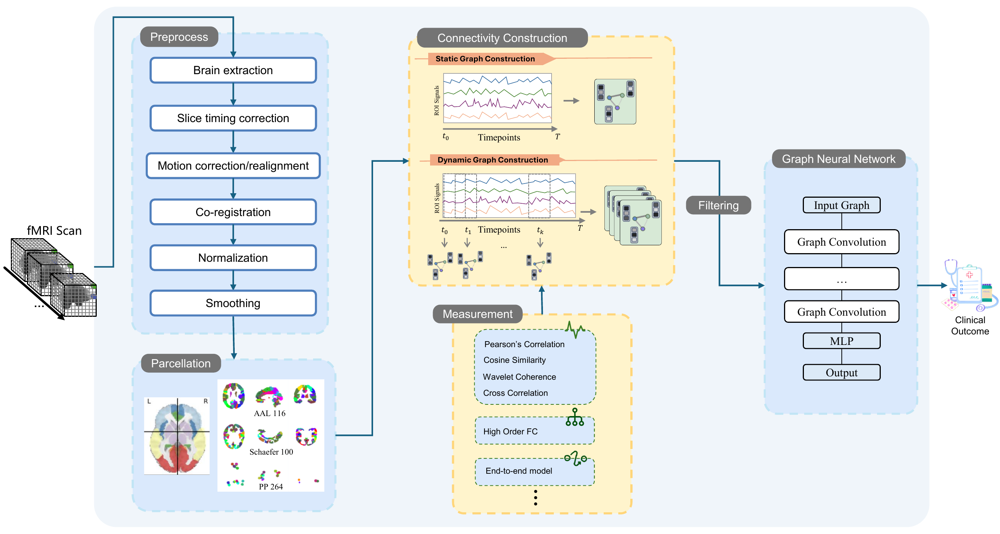
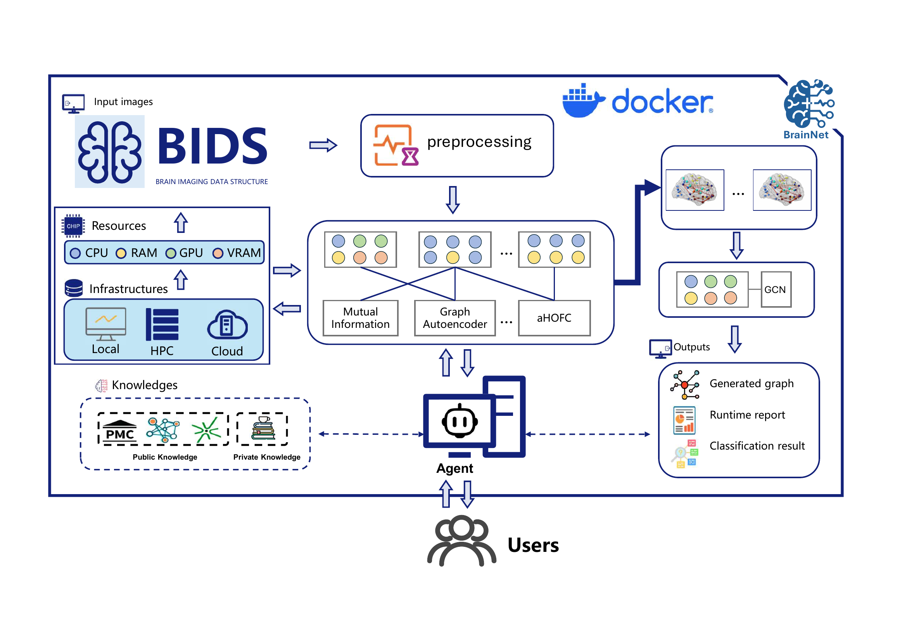

# BrainNet: A Systematic Benchmark for Functional Brain Network Generation and Analysis

BrainNet is a systematic benchmark for constructing ROI-based functional brain networks from resting-state fMRI. We evaluate 33 pipelines spanning node parcellations, connectivity definitions (pairwise, higher-order, and learned edges), sparsification/thresholding strategies, and static versus dynamic modeling — all under a unified training-validation protocol with a fixed graph neural network classifier.

Results show substantial variability across pipelines; notably, sparsification choices can invert method rankings, underscoring the importance of density control. Nonetheless, a compact set of configurations consistently meets reliability and performance criteria across ADNI, HCP S1200, and ADHD-200.

We introduce practical guidelines for reproducible connectome generation, open resources, and implications for downstream graph-based machine learning and clinical research.

- **Open-source package**: [brainnet-graph (PyPI)](https://pypi.org/project/brainnet-graph/)
- **Documentation**: [brainnet-graph.readthedocs.io](https://brainnet-graph.readthedocs.io/)

# Recent Papers

| Year | Title | Venue | Paper |
|------|-------|-------|-------|
| 2025 | BrainNet: A Systematic Benchmark for Functional Brain Network Generation and Analysis | arXiv | arXiv preprint |

# Contribution

We welcome contributions and feedback from the community. Please feel free to [email us](mailto:lih319@lehigh.edu).

# Citation

Please cite our paper if you find BrainNet useful for your work:

```text
@article{zhao2025brainnet,
  title={BrainNet: A Systematic Benchmark for Functional Brain Network Generation and Analysis},
  author={Zhao, Songlin and Luo, Xinwei and Gong, Ruonan and Yang, Yitian and Xu, Zhicheng and Chen, Jiaxin and Han, Keqi and Li, Xiang and Li, Quanzheng and Buckner, Randy L. and Sun, Lichao and Yang, Carl and Zhan, Liang and Zhang, Yu and He, Lifang},
  year={2025}
}
```

## Pipeline Overview

The general workflow: raw fMRI → preprocessing → parcellation → connectivity construction (static or dynamic) → graph filtering → GNN classifier → clinical prediction.



## System Architecture

The full system is Dockerized for easy reproduction. Source data are BIDS images. A RAG-enabled agent orchestrates runs, aggregates logs, and returns runtime reports and explanations to users.



## Key Findings

- **Node definition**: Parcellation scale and principle materially affect network topology and variance.
- **Connectivity measures**: Pearson correlation is a strong baseline; partial correlation and HOFC frequently surpass it.
- **Sparsification**: Filtering decisions have outsized effects — sparsification is a first-class hyperparameter, not a minor post-processing step.
- **Dynamic graphs**: Provide additional gains when scan duration and data quality support time-varying modeling.
